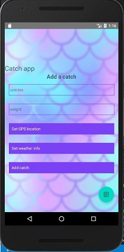
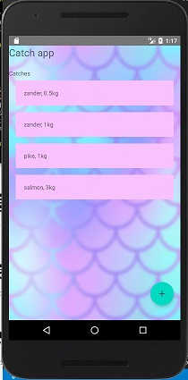

# fishing diary app

Main purpose of this project is to brush up the undersigned's rusted react-native skills.
  
App that will be created will be a fishing diary app, where users can log info of their catches. 
App will use phone's GPS sensor, if desired/available and some weather api.

First prototype of the UI:

 

## Project progress:
- [x] View components for list and form
- [x] Logic to view-components
- [x] Database
- [x] Location support
- [x] Weather api support
- [ ] Refactoring
- [ ] More functionalities?
- [ ] Final tests
- [ ] Finish

## Credits
### Weather data:
[openweathermap](https://openweathermap.org/)

### Icons:
[react-native-vector-icons](https://github.com/oblador/react-native-vector-icons)
